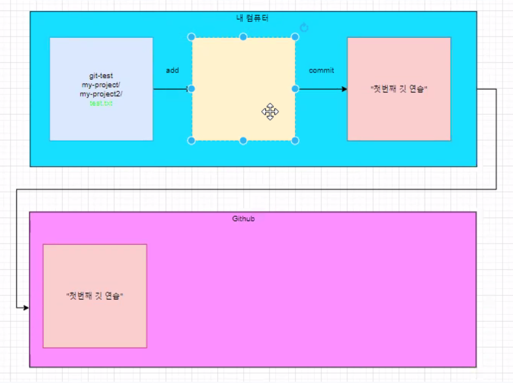

# git basic command

- add
- commit
- push


## github 정리 블로그

https://backlog.com/git-tutorial/kr/intro/intro1_3.html


## github 사용에 대한 전체적인 mapping



## init

- 초기에 폴더를 git으로 관리하겠다고 선언하는 명령어
- 
- 현재 폴더에 .git/ 폴더가 생성된다.


## add

- 중간저장 또는 임시저장의 개념
- git add . 명령어를 통해 전체 파일을 한번에 add 가능.


## commit

- add 되어 있는 파일들을 하나의 버전으로 묶어주는 명령어
- -m 옵션으로 커밋메세지를 입력할 수 있다(거의 필수).\


## push

- local에 있는 커밋기록을 원격저장소로 업로드 한다.


## remote

- 원격으로 github와 같은 서비스와 연결해주기 위한 것

## clone

- 원격 저장소에 있는 프로젝트를 복제하는 명령어

```shell
 $ git clone <원격저장소 주소>
```


## pull

- 원격저장소에서 최근 커밋을 불러오는 명령어.

